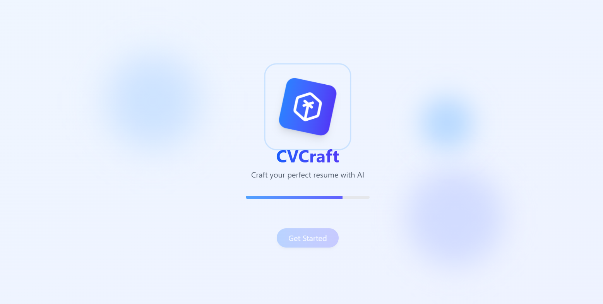
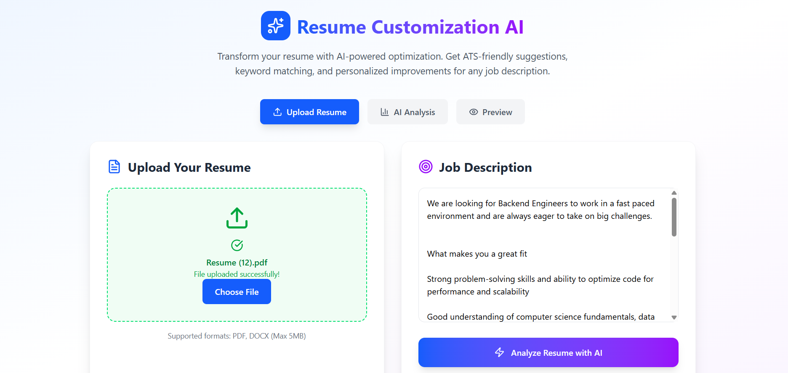
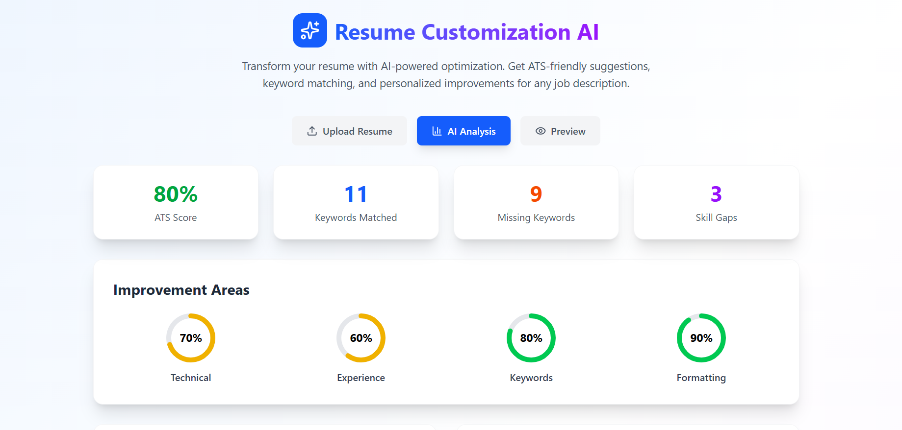
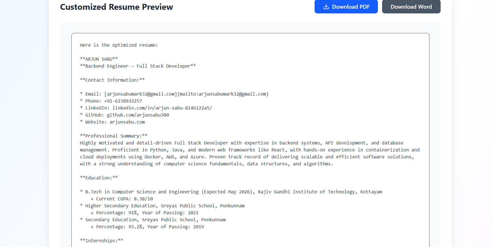
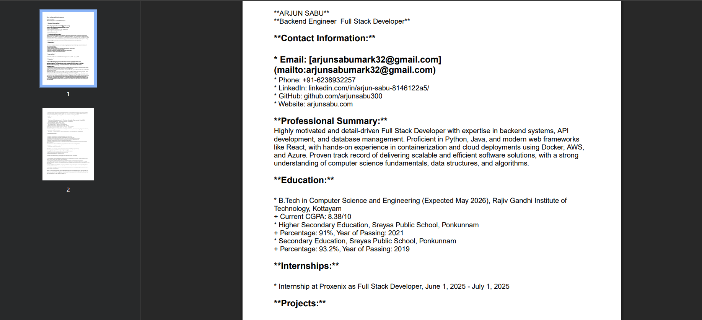

# CvCraft 🎯  
**AI-Powered Resume Customizer & ATS Optimizer**  

CvCrafts helps job seekers tailor their resumes to match job descriptions by analyzing **keywords, ATS score, and suggesting improvements**. Powered by **Groq API**, it also generates an optimized version of the resume ready for submission.  

---

## 🚀 Features  
- 📄 **Upload Resume** (PDF or DOCX)  
- 📝 **Paste Job Description**  
- 🔍 **Keyword Gap Analysis**  
- 📊 **ATS Score Calculation**  
- 🆕 **Generate Optimized Resume**  
- ⚡ **Fast Processing** with Groq API  

---

## 🛠 How It Works  
1. **Upload your resume** in PDF/DOCX format.  
2. **Enter or paste the job description** in the input field.  
3. The system **extracts keywords** from the job description.  
4. Your resume is analyzed for **missing keywords**.  
5. **ATS Score** is calculated based on keyword match & formatting.  
6. An **optimized resume** is generated for download.  

---

## 📂 Project Structure  
```

CvCrafts/
│── backend/            # Node.js/Express server
│── frontend/           # React.js frontend
│── .env                # Environment variables
│── package.json
│── README.md

````

---

## 🔑 Environment Variables (.env)  

Create a `.env` file in the **root directory** with the following values:

```env
GROQ_API_KEY=your_groq_api_key_here
PORT=5000
NODE_ENV=development
FRONTEND_URL=http://localhost:5173
MAX_FILE_SIZE=5242880
SESSION_SECRET=your_secret_key_here
````

---

## ⚙️ Installation

### 1️⃣ Clone the Repository

```bash
git clone https://github.com/your-username/CvCrafts.git
cd CvCrafts
```

### 2️⃣ Install Backend Dependencies

```bash
cd backend
npm install
```

### 3️⃣ Install Frontend Dependencies

```bash
cd ../frontend
npm install
```

---

## ▶️ Running the Project

### Start Backend Server

```bash
cd backend
npm run dev
```

### Start Frontend (React)

```bash
cd ../frontend
npm run dev
```

---

## 📸 Screenshots

Here’s a preview of **CvCrafts** in action:

### Welcome Page


### 🏠 Home Page


### 📊 Analysis Results


### 📄 Resume Preview


### 🆕 Generated Resume


## 🛡 Security Notes

* Do **NOT** commit your `.env` file — it's already included in `.gitignore`.
* Keep your **GROQ\_API\_KEY** private.

---

## 🤝 Contributing

Contributions are welcome! Please fork the repo and submit a PR.
go “Wow!” when they see it.
```
